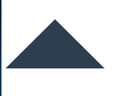

## 制作一个三角形

```html
<div class="triangle"></div>
```

```css
.triangle {
  width: 0;
  border: 100px solid;
  border-left-color: transparent;
  border-right-color: transparent;
  border-top-color: transparent;
}
```

