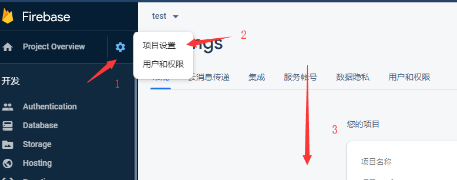
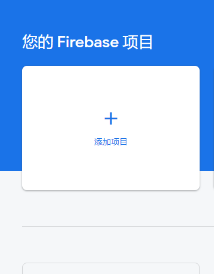
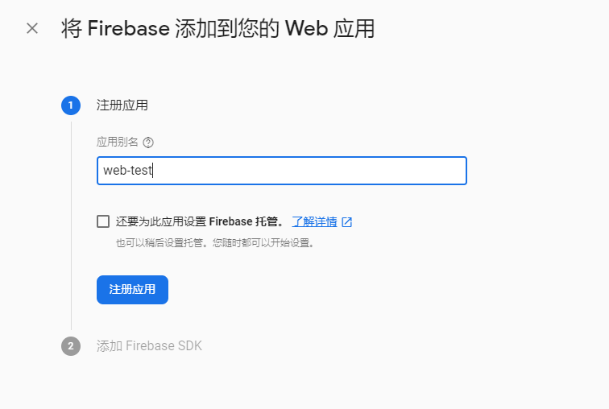

## 删除项目

因为之前创建过无用的项目，想把这些项目删除但发现删除没能找到，因此记录一下。其中第三步需要到页面最底下才能发现有一段**删除项目**的文字。

## 创建项目

本项目关于读取**firebase**的databse的Realtime Database的数据

- 第一步: 点击添加项目

- 第二步: 一直下一步，然后到最后新建项目

- 第三步: 添加一个web应用

- 第四步: 起应用别名，**注册应用**后会出来一段代码，把它粘贴到新建的html网页的闭合body标签(即`</body>`)的上面

- 第五步: 按照如下教程走[YouTube-入门](https://www.youtube.com/watch?v=k1D0_wFlXgo)，需要注意的是需要自己创建database数据

## 案例

查看[index.html](./index.html)，只需要填入你的`firebaseConfig`数据就可以了。

## 注意点

1. 在第五步的时候，你会发现报错`firebase.database is not a function`，解决措施是加上一句`script`的引用`
`这样就能正常使用了
2. 要修改database的数据直接enter键就行了

## 参考教程

- [YouTube-入门](https://www.youtube.com/watch?v=k1D0_wFlXgo)

